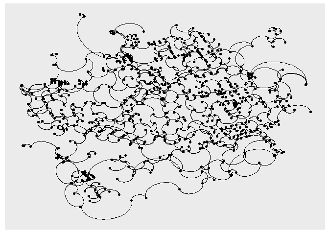

sfnetworks\_viz
===============

Hackathon on `sfnetworks` visualization
---------------------------------------

This is the issue for this hackathon:
<a href="https://github.com/luukvdmeer/sfnetworks/issues/7" class="uri">https://github.com/luukvdmeer/sfnetworks/issues/7</a>

We started this hackathon with [Pedro
Pérez](https://github.com/perezp44) and [John
Coene](https://github.com/JohnCoene) by brainstorming on what would be
good ways of visualizing `sfnetwork` objects.

In honor of time, we decided to look into how to use the `sfnetwork`
class with [`ggraph`](https://ggraph.data-imaginist.com/index.html).

`ggraph` mapping
----------------

This package is meant to support a grammar of graphics for relational
data. It works perfectly with `tbl_graph` objects and since `sfnetworks`
subclasses `tbl_graph` we thought it would be not so difficult to
already use it inside `ggraph()`.

### Some background on how `ggraph` works:

-   [Layouts](https://ggraph.data-imaginist.com/articles/Layouts.html):
    Defines how nodes are placed on the plot, so where to put each node.
-   [Nodes](https://ggraph.data-imaginist.com/articles/Nodes.html): how
    the nodes are represented.
-   [Edges](https://ggraph.data-imaginist.com/articles/Edges.html): how
    the edges are represented.

### What we found out:

-   We can pass X and Y coordinates to the layout function to place the
    nodes on the plot. As `sfnetworks` has its nodes as an `sf` object
    with a `POINT` geometry, we can retrieve those X and Y coordinates
    easily.
-   Nodes will take their placing from the layout, and `geom_node_*()`
    will basically be in charge of figuring out how it should be
    represented. Usually we would go for `geom_node_point()` on a
    “spatial” representation of a network.
-   Edges can have different representations between their from and to
    edges which are already supported when an appropriate layout is
    established. But, when we want to plot the edges to their faithful
    location in space, we need to think of a new `geom_edge_*()`
    function.

### Let’s go to the code

We first call the workforce (packages) and save our sample data on an
object:

    library(ggraph)
    library(ggplot2)
    library(tidygraph)
    library(sfnetworks)
    library(sf)

    (roxel_net = as_sfnetwork(roxel, directed = F)) 

    ## # An sfnetwork with 701 nodes and 851 edges
    ## #
    ## # CRS:  EPSG:4326 
    ## #
    ## # An undirected multigraph with 14 components with spatially explicit edges
    ## #
    ## # Node Data:     701 x 1 (active)
    ## # Geometry type: POINT
    ## # Dimension:     XY
    ## # Bounding box:  xmin: 7.522622 ymin: 51.94151 xmax: 7.546705 ymax: 51.9612
    ##              geometry
    ##           <POINT [°]>
    ## 1 (7.533722 51.95556)
    ## 2 (7.533461 51.95576)
    ## 3 (7.532442 51.95422)
    ## 4  (7.53209 51.95328)
    ## 5 (7.532709 51.95209)
    ## 6 (7.532869 51.95257)
    ## # ... with 695 more rows
    ## #
    ## # Edge Data:     851 x 5
    ## # Geometry type: LINESTRING
    ## # Dimension:     XY
    ## # Bounding box:  xmin: 7.522594 ymin: 51.94151 xmax: 7.546705 ymax: 51.9612
    ##    from    to name           type                                       geometry
    ##   <int> <int> <fct>          <fct>                              <LINESTRING [°]>
    ## 1     1     2 Havixbecker S~ residen~     (7.533722 51.95556, 7.533461 51.95576)
    ## 2     3     4 Pienersallee   seconda~ (7.532442 51.95422, 7.53236 51.95377, 7.5~
    ## 3     5     6 Schulte-Bernd~ residen~ (7.532709 51.95209, 7.532823 51.95239, 7.~
    ## # ... with 848 more rows

Since `sfnetwork` subclasses `tbl_graph` we can already put it into
`ggraph`, but the chosen layout for the nodes might not be the most
appropriate:

    roxel_net %>% 
      as_tbl_graph() %>% 
      ggraph() +
      geom_node_point() +
      geom_edge_link()

    ## Using `stress` as default layout

So, let’s create a layout function! As explained before, we can retrieve
the X and Y coordinates of the nodes, since they are an `sf` object with
`POINT` geometry:

    layout_sf <- function(graph){
      graph %>% 
        activate("nodes") %>% 
        mutate(
          x = sf::st_coordinates(.)[,"X"],
          y = sf::st_coordinates(.)[,"Y"]
        )
    }

We can now use this layout inside `ggraph`:

    roxel_net %>% 
      ggraph(layout = layout_sf) +
      geom_node_point()

You will see some spatial distortion up there and that will be due to
the lat/long nature of the `sfnetwork` CRS. This remains for now an
issue to look into…

But, for now let’s get going! We can now plot nodes on their
geographical space! And than add any edge representation between them:

    roxel_net %>% 
      # st_transform(3035) %>% 
      ggraph(layout = layout_sf) +
      geom_node_point() +
      geom_edge_arc()

But, we also want to be able to plot edges in their geographical space.
So for this we propose creating a new `geom_edge_*()` function that
builds on top of `geom_sf()` in ggplot2 which handles `sf` objects.

First we fetch the edges:

    get_sf_edges <- function(){
      function(layout) {
        attr(layout, "graph") %>% 
          as_sfnetwork(directed = FALSE) %>% 
          activate("edges") %>% 
          sf::st_as_sf()
      }
    }

And then we can create `geom_edge_sf()`:

    geom_edge_sf = function (mapping = NULL, data = get_sf_edges(), ...){
      geom_sf(data = data, mapping = mapping, ...)
    }

And we can easily add it to our plot!

    roxel_net %>% 
      ggraph(layout = layout_sf) +
      geom_node_point() + 
      geom_edge_sf(aes(color = type))

 And there
we have it! Note how the distortion get’s handle by `geom_sf()` very
nicely!

### (Recap of) open issues:

-   We still need to think how to handle lat/long data on the layout\_sf
    function, since unprojected networks can appear distorted when
    plotted.

### Other visualization opportunities:

-   explore 3D representation, maybe with `rayshader`
    -   this can take a look into st\_zm coordinates
-   maybe look into interactive plotting: `mapview`

Summary:
--------

-   A `layout_sf()` function can be implemented to plot the nodes in
    their geographical space.
-   A `geom_edge_sf()` function can be implemented to plot edges on
    their geographical space and still access their columns to map
    aesthetics.

The ultimate goal would be to create a pull request to `ggraph`!
