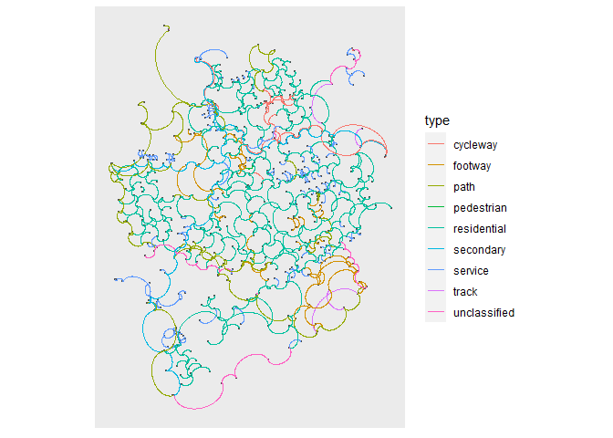

sfnetworks\_viz
===============

Hackathon on `sfnetworks` visualization
---------------------------------------

This is the issue for this hackathon:
<a href="https://github.com/luukvdmeer/sfnetworks/issues/7" class="uri">https://github.com/luukvdmeer/sfnetworks/issues/7</a>

We started this hackathon with [Pedro
Pérez](https://github.com/perezp44) and [John
Coene](https://github.com/JohnCoene) by brainstorming on what would be
good ways of visualizing `sfnetwork` objects.

In honor of time, we decided to look into how to use the `sfnetwork`
class with [`ggraph`](https://ggraph.data-imaginist.com/index.html).

`ggraph` mapping
----------------

This package is meant to support a grammar of graphics for relational
data. It works perfectly with `tbl_graph` objects and since `sfnetworks`
subclasses `tbl_graph` we thought it would be not so difficult to
already use it inside `ggraph()`.

### Some background on how `ggraph` works:

-   [Layouts](https://ggraph.data-imaginist.com/articles/Layouts.html):
    Defines the position of the nodes in the plot.
-   [Nodes](https://ggraph.data-imaginist.com/articles/Nodes.html): how
    the nodes are represented.
-   [Edges](https://ggraph.data-imaginist.com/articles/Edges.html): how
    the edges are represented.

### What we found out:

-   We can pass X and Y coordinates to the layout function to place the
    nodes on the plot. As `sfnetworks` has its nodes as an `sf` object
    with a `POINT` geometry, we can retrieve those X and Y coordinates
    easily.
-   Nodes will take their placing from the layout, and `geom_node_*()`
    will basically be in charge of figuring out how it should be
    represented. Usually we would go for `geom_node_point()` on a
    “spatial” representation of a network.
-   Edges can have different representations between their from and to
    edges which are already supported when an appropriate layout is
    established. But, when we want to plot the edges to their faithful
    location in space, we need to think of a new `geom_edge_*()`
    function.

### Let’s go to the code

We first call the workforce (packages) and save our sample data to an
object:

    library(ggraph)
    library(ggplot2)
    library(tidygraph)
    library(sfnetworks)
    library(sf)

    (roxel_net = as_sfnetwork(st_transform(roxel,31466), directed = F)) 

    ## # An sfnetwork with 701 nodes and 851 edges
    ## #
    ## # CRS:  EPSG:31466 
    ## #
    ## # An undirected multigraph with 14 components with spatially explicit edges
    ## #
    ## # Node Data:     701 x 1 (active)
    ## # Geometry type: POINT
    ## # Dimension:     XY
    ## # Bounding box:  xmin: 2604716 ymin: 5757500 xmax: 2606378 ymax: 5759691
    ##            geometry
    ##         <POINT [m]>
    ## 1 (2605475 5759072)
    ## 2 (2605457 5759094)
    ## 3 (2605391 5758921)
    ## 4 (2605369 5758816)
    ## 5 (2605414 5758684)
    ## 6 (2605424 5758738)
    ## # ... with 695 more rows
    ## #
    ## # Edge Data:     851 x 5
    ## # Geometry type: LINESTRING
    ## # Dimension:     XY
    ## # Bounding box:  xmin: 2604715 ymin: 5757500 xmax: 2606378 ymax: 5759691
    ##    from    to name            type                                      geometry
    ##   <int> <int> <fct>           <fct>                             <LINESTRING [m]>
    ## 1     1     2 Havixbecker St~ resident~       (2605475 5759072, 2605457 5759094)
    ## 2     3     4 Pienersallee    secondary (2605391 5758921, 2605386 5758871, 2605~
    ## 3     5     6 Schulte-Bernd-~ resident~ (2605414 5758684, 2605421 5758718, 2605~
    ## # ... with 848 more rows

Since `sfnetwork` subclasses `tbl_graph` we can already put it into
`ggraph`, but the chosen layout for the nodes might not be the most
appropriate:

    roxel_net %>% 
      ggraph() +
      geom_node_point() +
      geom_edge_link()

    ## Using `stress` as default layout

So, let’s create a layout function! As explained before, we can retrieve
the X and Y coordinates of the nodes, since they are an `sf` object with
`POINT` geometry:

    layout_sf <- function(graph){
      graph %>% 
        activate("nodes") %>% 
        mutate(
          x = sf::st_coordinates(.)[,"X"],
          y = sf::st_coordinates(.)[,"Y"]
        )
    }

We can now use this layout inside `ggraph`:

    roxel_net %>% 
      ggraph(layout = layout_sf) +
      geom_node_point()

You will see some spatial distortion up there and that will be due to
the CRS present on `sfnetwork` objects.

So to better plot nodes and edges in their geographical space, we
propose creating new `geom_node_*()` and `geom_edge_*()` functions that
builds on top of `geom_sf()` in ggplot2 which handles `sf` objects.

First we fetch the nodes and edges:

    get_sf_nodes <- function(){
      function(layout) {
        sf::st_as_sf(attr(layout, "graph"), "nodes")
      }
    }
    get_sf_edges <- function(){
      function(layout) {
        sf::st_as_sf(attr(layout, "graph"), "edges")
      }
    }

And then we can create `geom_node_sf()` and `geom_edge_sf()`:

    geom_node_sf <- function (mapping = NULL, data = get_sf_nodes(), ...){
      geom_sf(data = data, mapping = mapping, ...)
    }
    geom_edge_sf <- function (mapping = NULL, data = get_sf_edges(), ...){
      geom_sf(data = data, mapping = mapping, ...)
    }

And we can easily add it to our plot!

    roxel_net %>% 
      ggraph(layout = layout_sf) +
      geom_node_sf(color = 'grey30', size = 0.5) +
      geom_edge_sf(aes(color = type)) 

With any edge representation we want:

    roxel_net %>% 
      ggraph(layout = layout_sf) +
      geom_node_sf(color = 'grey30', size = 0.5) +
      geom_edge_arc(aes(color = type)) 

And there we have it! Note how the distortion get’s handle by
`geom_sf()` very nicely!

### (Update of) open issues:

-   We still need to think how to handle lat/long data on the layout\_sf
    function, since unprojected networks can appear distorted when
    plotted.
    -   Creating a geom\_node\_sf as well as a geom\_edge\_sf would
        solve the problem, since it is not only for lat/long or
        unprojected networks.
-   We should take a look internally at `layout_tbl_graph_manual` to
    implement the new layout.
    -   It could be that the CRS should be handled on the layout
        function. Otherwise, when plotting nodes or edges without teh
        new `sf` geoms, the network is distorted.

### Other visualization opportunities:

-   explore 3D representation, maybe with `rayshader`
    -   this can take a look into st\_zm coordinates
-   maybe look into interactive plotting: `mapview`

Summary:
--------

-   A `layout_sf()` function can be implemented to plot the graph in
    their geographical space.
-   Two new functions: `geom_node_sf()` and `geom_edge_sf()` functions
    can be implemented to plot the graph in its geographical space and
    still access their columns to map aesthetics.

The ultimate goal would be to create a pull request to `ggraph`!
